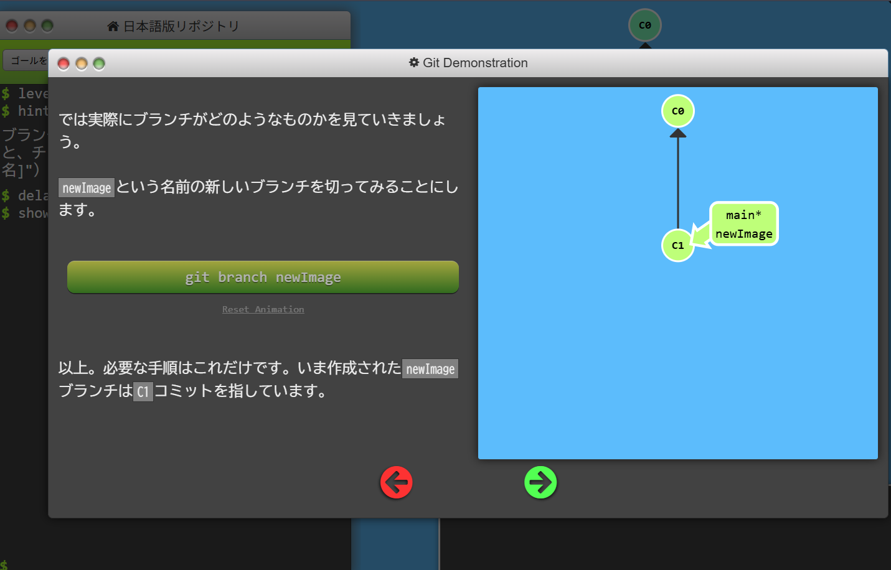

# ソフトウェア工学振り返り

# 第1回、第2回
・第1回及び第2回の講義では、<u>ガイダンス及びソフトウェア工学論の概説</u>が行われた。  
ソフトウェアの定義として、実行されることによって必要な特性、機能、性能を提供する命令後群(コンピュータプログラム)、プログラムが適切に情報を扱うことを可能とするデータ構造、プログラムの操作や使用法を記述した情報であることが挙げられた。  
ハードウェアと違って、劣化することはないが悪化することはあることが一つのポイントとなる。  
長期的な運用のためにも、新しい環境や技術のニーズを満たすための適応や、より近代的なシステムやデータベースと相互運用するための拡張などがソフトウェアには求められる。  
上記の要求を満たせるよう、ソフトウェアの開発、運用、メンテナンスに対して定量化できるアプローチの適用、言い換えればソフトウェアに対するエンジニアリングの適用を目指すのがソフトウェア工学である。  
ソフトウェア工学はプログラミングの演習とは異なり、プログラムの想定稼働期間などの時間的要素や、開発の規模を踏まえた人員配置などのスケール、そして時間とスケールのトレードオフな関係性について考える学問である。<u>開発環境のみならず、プロジェクト全体を見据えている</u>と言っても良い。  

# 第3回
・第3回の講義では、<u>ソフトウェアライフサイクル</u>について学んだ。
ソフトウェアの生は、ソフトウェアの誕生、ソフトウェアの開発・運用、ソフトウェアの廃止の大きく3つに分けられる。  
ソフトウェアの誕生には、ニーズの発生や、要件定義書の作成が含まれる。要件定義書とは、システムの目的や機能の説明、目標性能、他システムとのインターフェース仕様、開発スケジュールなどが記された文書である。  
企業によって要件定義項目は異なるが、実現する機能及び実現しない機能を明確にすることが要件定義において重要となる。  
要件定義は他にも、プロジェクト関係者間でスコープの共有を行う事や、社内外へプロジェクト内容を明文化して協力を仰ぐ事を意義としている。  
ソフトウェアの開発・運用では、要件定義書を設計書へと落とし込み、システムを構築していく。修正、テストを繰り返したのち、納品を行うが、ソースコードを一緒に納品するかどうかでソフトウェアの運用方法が異なる。  
ソースコードを納品物に含める場合、メンテナンスは自社で行うことが可能だが、含めない場合、メンテナンスを行うには作業委託契約を締結する必要がある。  
ソフトウェアの廃止の期間では、サービスの終了や、新規ソフトウェアへのリニューアルについての計画を行う。これまでの要件定義をどのように引き継ぐかなどについて考慮がなされる期間でもある。

# 第4回
・第4回の講義では、<u>プロジェクトの定義</u>、<u>ソフトウェア分析</u>、<u>開発プロセス</u>について学んだ。  
プロジェクトとは、必ず終わりが定義されている有期性の仕事であり、また独自の目的を達成する類の仕事である。  
プロジェクトは、定めた目標に向けて何が必要かを計画し、達成に向かうバックキャスティングが前提となっており、プロジェクトの立ち上げ時における明確な目標の設定及び、目標に向けての道筋の検討が重要となる。  
ソフトウェアの評価についてはいくつかの視点があることを学んだ。ステップ数視点やオブジェクト容量視点でのコードの物量を考慮した評価、ファンクションポイント法での評価、使い勝手の良さをもとにした評価など様々である。  
開発プロセスについてもいくか種類があることを学んだ。開発全体の工程を上流から下流へと一方向へと進めるウォーターフォール型プロセス、  
小さな成果物を短い期間で作ることを繰り返し、ニーズの変化に適応しやすくしているアジャイルプロセス、  
ウォーターフォール型とアジャイルプロセスの中間のようなモデルであるスパイラルモデルなどについて理解を深めた。

# 第5回、第6回
・第5回及び第6回の講義では<u>WBS(Work Breakdown Structure)の作成演習</u>を行った。  
WBSとは、プロジェクト全体を細かな作業に分解し、プロジェクトにおける各担当メンバーの作業レベルまで分解した構成図である。  
演習では、自分と二人の友人で役割分担して、情報工学科内でイベントを催すという設定の下、スプレッドシートを用いてWBSを作成した。  
演習にて作成したWBSの画像を下に添付している。  
WBSを作成する際は、イベントの開催日から逆算して行動を計画するトップダウンではなく、当日の会場の予約やオンライン告知の計画など、  
イベントの企画に必要な作業を可能な限りリストアップし、それらを順番に片づけていく<u>ボトムアップ</u>での計画を意識した。

  

# 第7回
・第7回の講義ではPythonのPEP8に基づいて、読みやすいコードの書き方を学んだ。
PEP8はコードの長さやコメントの書き方、スペースの入れ方などにルールを定めたスタイルガイドである。  
講義では、任意のPythonファイルをPEP8に基づいて精査するツールであるflake8を使って、与えられたPythonファイルから検出されたスタイルエラーをすべて解決する課題が出された。

# 第8回、第9回、第10回
・第8回からの講義では、<u>ソフトウェアのバージョン管理</u>について学んだ。  
ソフトウェアのバージョンを更新していくにあたって、いつ、誰が、どのような変更を加えたのかの情報を記録することや、更新後に予想外の不具合が発生した場合に更新前の状態に戻せることは不可欠である。  
これらの課題を解決してくれるバージョン管理のためのツールの1つにgitがある。  
gitは変更履歴の管理や過去への復元、複数人での安全な共同作業を実現する分散型のバージョン管理システムである。  
開発者は**リポジトリ**と呼ばれるソフトウェアのソースコードのデータプールをネットワーク越しに複数人で共有しながら開発を行う。  
gitでは、ネットワーク越しにあるリポジトリ(<u>リモートリポジトリ</u>)を、開発者ごとのローカル環境にコピーすることで、ネットワークから切り離した環境(<u>ローカルリポジトリ</u>)で開発を進めることができる。  
講義では「Learn Git Branching」というGitの使い方を学べるサイトを使って、ブランチの作成や統合の操作の他、ローカル環境へのリポジトリの複製などの操作の学習を行った。

>
[Learn Git Branchingのサイト](https://learngitbranching.js.org/?locale=ja)

# 第11回
・第11回の講義では、<u>GitHub</u>についての学習と、GitHubで簡易的なプロジェクトを作成する演習を行った。  
GitHubとは、リモートリポジトリのホスティングサービスの一つであり、webサイトを通じて、複数の開発者間でのリポジトリの共有をより円滑に行うことを可能としている。  
GitHub上では他人のリモートリポジトリをforkコマンドを用いることで自分のリモートリポジトリへ複製することができ、cloneコマンドを用いることでローカルリポジトリへ複製できる。  
GitHubのプロジェクトのサイト画面では、開発者間でリポジトリに関する問題報告や機能追加、質問を上げるための"issues"、現在進行している作業を開発者間で共有できる"projects"といったページがある。  
演習では、hello-world演習に則って、リポジトリの作成から、pull requestを用いたブランチの統合までの開発操作を体験した。
>
[hello-world演習のサイト](https://docs.github.com/ja/get-started/start-your-journey/hello-world)

# 第12回
・第12回の講義では、<u>CI/CD</u>について学んだ。  
CIとは、Continuous Integrationの略で、コード変更と共有リポジトリに頻繁に統合するプロセスである。  
CIは自動テストとビルドを定期的に実行し、バグの早期発見と修正を可能にする。  
CDとは、Continuous Deliveryの略で、コード変更をテスト環境や本番環境に自動的にデプロイするプロセスである。  
CDは自動デプロイメントを組み込み、手動操作によるデプロイの必要性を排除する。  
以上のCIとCDをまとめて一つのワークフローに落とし込んだものをCI/CDパイプラインという。  
CI/CDパイプラインには基本的に6つのステップがある。
- 1つ目はコード変更をトリガーにワークフローを起動する「ソース」
- 2つ目はソースコードをコンパイルする「ビルド」
- 3つ目は自動テストを実行する「テスト」
- 4つ目はテスト済みのコードを本番環境にデプロイする「デプロイ」
- 5つ目はデプロイされたアプリケーションの動作を確認する「検証」
- 6つ目は本番環境での継続的な監視を行う「モニタリング」

3つ目の「テスト」にて失敗したり、5つ目の「検証」にて問題が検出される度に「ソース」のステップに立ち返る。  
講義ではGitHubが提供しているワークフローの自動化ツールであるGitHub Actionsと第7回講義にて扱ったflake8を用いて、CIの適用を体験した。

